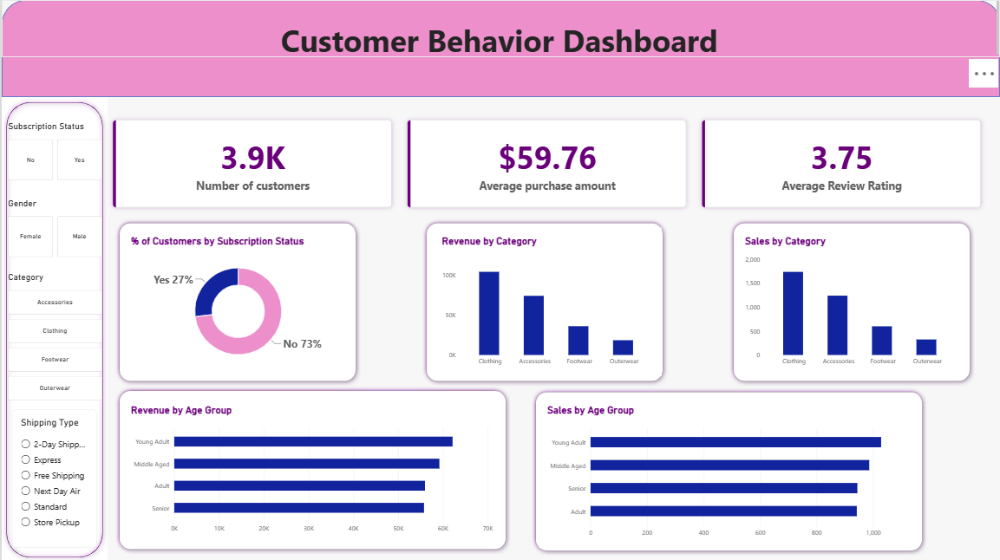

# Customer Shopping Behavior Analytics

## Overview

This project analyzes **customer shopping behavior** to identify purchasing patterns, customer segments, product performance, discount usage, subscription behavior, and revenue trends.

The project follows an end-to-end data analytics workflow:

**Raw Dataset → Python EDA & Data Cleaning → PostgreSQL → SQL Analysis → Power BI Dashboard → Business Report → Presentation**

The objective is to transform raw customer transaction data into meaningful insights that can support **customer segmentation, product strategy, pricing/discount decisions, and subscription analysis**.

---

## Dataset

The dataset contains **3,900 customer shopping records** with 18 original attributes covering customer demographics, purchases, products, reviews, subscriptions, shipping, discounts, payment methods, and purchase frequency.

### Key Attributes

| Column                 | Description                         |
| ---------------------- | ----------------------------------- |
| Customer ID            | Unique customer identifier          |
| Age                    | Customer age                        |
| Gender                 | Customer gender                     |
| Item Purchased         | Product purchased                   |
| Category               | Product category                    |
| Purchase Amount (USD)  | Amount spent on the purchase        |
| Location               | Customer location                   |
| Size                   | Product size                        |
| Color                  | Product color                       |
| Season                 | Season of purchase                  |
| Review Rating          | Customer review rating              |
| Subscription Status    | Whether the customer is subscribed  |
| Shipping Type          | Shipping method selected            |
| Discount Applied       | Whether a discount was applied      |
| Promo Code Used        | Whether a promotional code was used |
| Previous Purchases     | Number of previous purchases        |
| Payment Method         | Payment method used                 |
| Frequency of Purchases | Customer purchase frequency         |

The dataset contains **37 missing values in Review Rating**, which were handled during the data-cleaning process.

---

## Tools & Technologies

* **Python**

  * Pandas
  * NumPy
  * Matplotlib / Seaborn
* **Jupyter Notebook**
* **PostgreSQL**
* **SQL**
* **Power BI**
* **Gamma** — presentation creation
* **CSV** — raw dataset format

---

# Project Workflow

## 1. Data Loading

The dataset was loaded into Python using Pandas.

```python
import pandas as pd

df = pd.read_csv("customer_shopping_behavior.csv")
```

Initial inspection was performed using:

* `head()`
* `info()`
* `describe()`
* `isnull().sum()`

This helped understand the dataset structure, data types, statistical characteristics, and missing values.

---

## 2. Exploratory Data Analysis

Exploratory Data Analysis was performed to understand customer and purchasing behavior.

The analysis examined:

* Customer demographics
* Product categories
* Purchase amounts
* Review ratings
* Subscription status
* Shipping methods
* Discount usage
* Previous purchases
* Purchase frequency
* Payment methods
* Seasonal behavior

The EDA helped identify data-quality issues and determine which variables could be useful for further analysis.

---

## 3. Data Cleaning & Transformation

Several preprocessing steps were performed before loading the data into the database.

### Missing Review Ratings

The dataset contained missing values in `Review Rating`.

Instead of replacing all missing values with a single overall median, the missing ratings were filled using the **median review rating of the corresponding product category**.

```python
df['Review Rating'] = df.groupby('Category')['Review Rating'].transform(
    lambda x: x.fillna(x.median())
)
```

This preserves differences in rating behavior across product categories.

### Column Standardization

Column names were converted into lowercase and spaces were replaced with underscores.

For example:

```text
Customer ID → customer_id
Purchase Amount (USD) → purchase_amount
```

The final columns therefore follow a consistent **snake_case** naming convention.

### Age Group

An `age_group` column was created using quartile-based segmentation:

* Young Adult
* Adult
* Middle Aged
* Senior

```python
df['age_group'] = pd.qcut(
    df['age'],
    q=4,
    labels=['Young Adult', 'Adult', 'Middle Aged', 'Senior']
)
```

### Purchase Frequency

The text-based purchase frequency was converted into numerical days between purchases.

Examples:

```text
Weekly → 7
Fortnightly → 14
Monthly → 30
Quarterly → 90
Annually → 365
```

This created a new `purchase_frequency_days` column that can be used for quantitative analysis.

### Redundant Column Removal

`Promo Code Used` was compared with `Discount Applied`.

Since the analysis found that both columns carried the same information in this dataset, `Promo Code Used` was removed to avoid redundancy.

---

# 4. PostgreSQL Database

After preprocessing, the cleaned DataFrame was loaded into a PostgreSQL database.

The resulting database table is:

```text
customer
```

The Python notebook uses **SQLAlchemy** and `psycopg2` to establish the PostgreSQL connection and load the cleaned dataset.

```python
df.to_sql(
    "customer",
    engine,
    if_exists="replace",
    index=False
)
```

---

# 5. SQL Business Analysis

Ten business questions were answered using SQL.

### Q1 — Revenue by Gender

Compared total revenue generated by male and female customers.

```sql
SELECT gender, SUM(purchase_amount) AS revenue
FROM customer
GROUP BY gender;
```

### Q2 — Discount Users with Above-Average Spending

Identified customers who used a discount but still spent at least the average purchase amount.

### Q3 — Highest-Rated Products

Identified the five products with the highest average review ratings.

### Q4 — Shipping Type Comparison

Compared average purchase amounts between **Standard** and **Express** shipping.

### Q5 — Subscriber vs Non-Subscriber Spending

Compared subscribers and non-subscribers based on:

* Number of customers
* Average spending
* Total revenue

### Q6 — Products with Highest Discount Usage

Identified the five products with the highest percentage of purchases involving discounts.

This provides an indication of products that may rely more heavily on promotional pricing.

### Q7 — Customer Segmentation

Customers were segmented based on previous purchases:

```text
1 previous purchase       → New
2–10 previous purchases   → Returning
More than 10              → Loyal
```

The number of customers in each segment was then calculated.

### Q8 — Top Products by Category

Used a window function with `ROW_NUMBER()` to identify the top three products within each product category based on order volume.

### Q9 — Repeat Buyers and Subscription

Analyzed whether customers with more than five previous purchases were subscribers or non-subscribers.

### Q10 — Revenue by Age Group

Calculated total revenue contribution from each age group and ordered the groups by revenue.

---

# 6. Power BI Dashboard

The SQL and cleaned dataset were used to create an interactive **Power BI dashboard**.

The dashboard provides a visual overview of customer purchasing behavior and allows users to analyze different customer and product segments.

### Dashboard Components

The dashboard includes analysis related to:

* Revenue
* Customer segments
* Product categories
* Purchase behavior
* Subscription status
* Discount usage
* Shipping methods
* Age groups
* Product performance

Interactive **slicers and filters** allow users to explore the data across different dimensions.

### Dashboard Preview


---

# 7. Business Report

A detailed analytical report was created to document the project.

The report covers:

* Business objective
* Dataset overview
* Data-cleaning methodology
* Exploratory analysis
* SQL analysis
* Dashboard insights
* Key findings
* Business implications
* Recommendations

---

# 8. Presentation

A presentation was created using **Gamma** to communicate the project findings in a concise business-oriented format.

The presentation summarizes:

* Business problem
* Dataset
* Analytical methodology
* Customer behavior analysis
* SQL findings
* Power BI dashboard
* Key insights
* Recommendations
* Conclusion

---

# Key Analysis Areas

The project focuses on five major analytical areas:

### Customer Behavior

Understanding purchasing frequency, previous purchases, age groups, and customer segments.

### Product Performance

Identifying highly rated products and top-selling products within each category.

### Revenue Analysis

Examining revenue across gender, age groups, subscription status, and other customer segments.

### Discount Analysis

Understanding discount penetration across products and identifying customers who spend significantly despite receiving discounts.

### Subscription Analysis

Comparing subscriber and non-subscriber behavior and examining subscription patterns among repeat buyers.

---

# Results

The analysis produces insights across:

* Customer segmentation
* Revenue contribution
* Product performance
* Discount dependency
* Subscription behavior
* Shipping preferences
* Customer purchasing frequency
* Age-group purchasing behavior

The SQL analysis provides a structured way to answer business questions, while the Power BI dashboard converts these findings into interactive visualizations for easier interpretation.

> **Note:** Specific numerical findings should be added here after finalizing the Power BI dashboard and analysis results.

---

# Project Structure

```text
Customer-Shopping-Behavior-Analytics/
│
├── data/
│   └── customer_shopping_behavior.csv
│
├── python/
│   └── customer_behavior.ipynb
│
├── sql/
│   └── customer_behavior_sql_queries.sql
│
├── powerbi/
│   └── customer_behavior_dashboard.pbix
│
├── report/
│   └── customer_behavior_report.pdf
│
├── presentation/
│   └── customer_behavior_presentation.pdf
│
├── images/
│   └── dashboard.png
│
└── README.md
```

---

# How to Run

## 1. Clone the Repository

```bash
git clone <repository-url>
cd Customer-Shopping-Behavior-Analytics
```

## 2. Install Python Dependencies

```bash
pip install pandas numpy matplotlib seaborn sqlalchemy psycopg2-binary jupyter
```

## 3. Run the Python Notebook

Open:

```text
python/customer_behavior.ipynb
```

Run the notebook sequentially to:

1. Load the dataset
2. Explore the data
3. Identify missing values
4. Clean and transform the data
5. Create analytical columns
6. Load the processed dataset into PostgreSQL

## 4. Set Up PostgreSQL

Create a PostgreSQL database and update the database connection details in the notebook.

The cleaned dataset is loaded into the:

```text
customer
```

table.

## 5. Run SQL Queries

Open:

```text
sql/customer_behavior_sql_queries.sql
```

Run the queries against the `customer` table to reproduce the business analysis.

## 6. Open Power BI

Open the `.pbix` dashboard file in **Power BI Desktop**.

If required, update the PostgreSQL data source and refresh the dashboard.

## 7. View the Report & Presentation

The final report and Gamma presentation can be found in their respective folders.

---

# Skills Demonstrated

* Python
* Pandas
* Exploratory Data Analysis
* Data Cleaning
* Data Transformation
* SQL
* PostgreSQL
* SQL Aggregations
* Subqueries
* CTEs
* Window Functions
* Customer Segmentation
* Business Analysis
* Power BI
* Data Visualization
* Dashboard Development
* Data Storytelling
* Business Reporting
* Presentation Development

---

# Conclusion

This project demonstrates an end-to-end approach to **customer shopping behavior analytics**, starting with raw transactional data and progressing through Python-based data preparation, SQL business analysis, and Power BI visualization.

The workflow demonstrates how raw customer data can be transformed into structured analysis and business-focused insights using a combination of **Python, SQL, PostgreSQL, and Power BI**.
